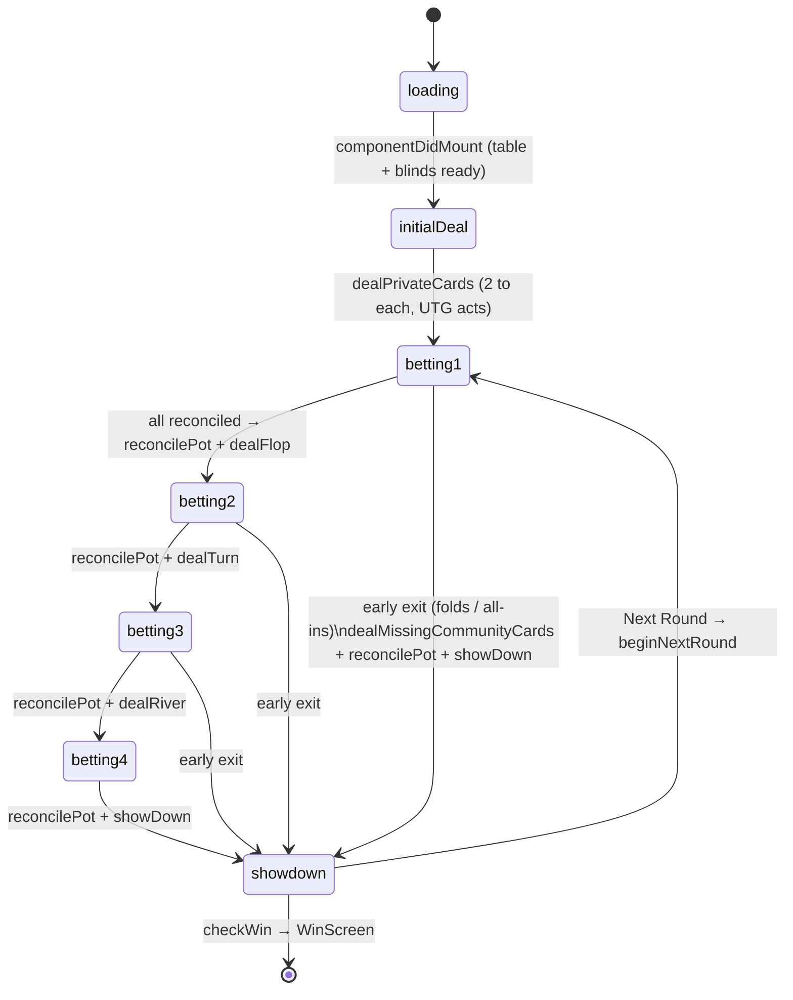
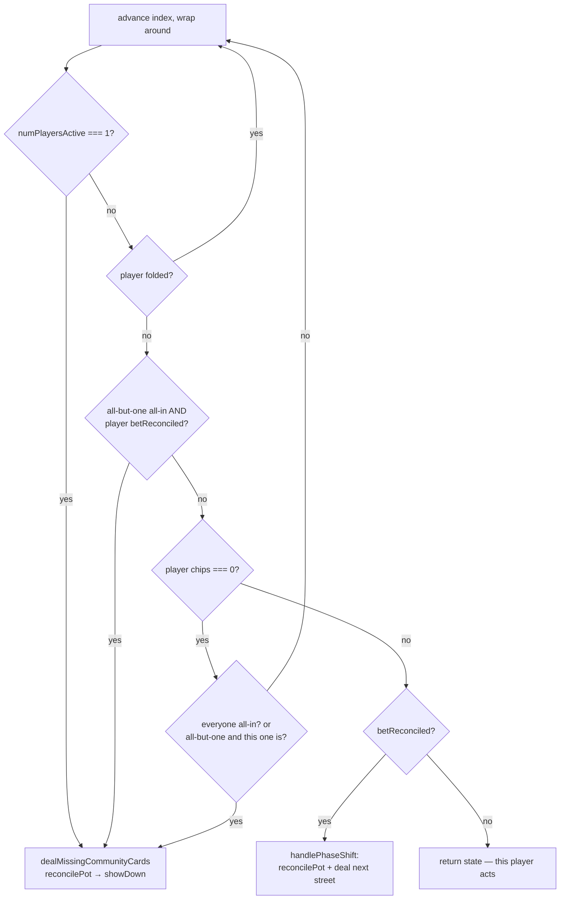

# React-Poker — Game Loop & Showdown Design Doc

This document maps the **current** runtime logic of the game: how the loop is
driven, how betting and pots are reconciled, and — in the most detail — how the
showdown/side-pot system resolves multi-way, capped-stack pots. Everything
described here was verified by executing the actual source modules against
mocked state (see [Appendix A](#appendix-a--simulation-verified-behavior)).
The open bug/quirk census lives in [§9](#9-open-bugs--quirks); resolved
entries, and the full history of fixes and features, live in
[CHANGELOG.md](./CHANGELOG.md) (numbering is shared and never reused).

Source layout:

| File | Role |
|---|---|
| `src/App.jsx` | React class component; owns all state; drives the loop via `setState` callbacks + `setTimeout` |
| `src/utils/cards.js` | Deck, dealing, hand evaluation, showdown resolution, comparators |
| `src/utils/bet.js` | Bet/fold handling, phase shifting, pot reconciliation, side-pot construction |
| `src/utils/players.js` | Table generation, turn order, round transitions, win check |
| `src/utils/ai.js` | Rule-based AI decisions |
| `src/utils/ui.js` | Presentational helpers (button text, messages, slider) |

---

## 1. Architecture at a glance

The game is a **synchronous state-transformer pipeline wrapped in a React class
component**. There is no reducer, store, or event queue. Instead:

1. `App` holds the entire game state in `this.state`.
2. Every player action (human click or AI decision) deep-clones the state
   (`cloneDeep`), hands the clone to a chain of utility functions that **mutate the
   clone freely and return it**, and commits the result with a single `setState`.
3. The `setState` callback re-arms the loop: if the new `activePlayerIndex` is a
   robot and the phase isn't `showdown`, a `setTimeout(handleAI, 1200)` is scheduled.
   If it's the human, nothing is scheduled — the loop **parks** until a button click.

So the "game loop" is really a *chain of self-scheduling state transitions*:

```
human click ──► handleBet/handleFold ─┐
                                      ├─► cloneDeep(state) ─► transform cascade ─► setState ─► callback
setTimeout ───► App.handleAI ─────────┘                                                  │
     ▲                                                                                   │
     └──────────────── if active player is robot && phase !== 'showdown' ────────────────┘
```

A single action can cascade through many transforms *synchronously* — e.g. a call
that closes the river betting round flows through
`handleBet → determineNextActivePlayer → handlePhaseShift → reconcilePot → showDown →
distributeSidePots` before one `setState` commits everything. This is why the app is
"limited to discrete play phases": each commit lands on a phase boundary, and there
is no way to pause mid-cascade for an animation beat.

### Key invariant

`player.chips + player.bet` is a player's total liquid stack at any moment. Chips
move: `chips → bet` (during a betting round) `→ pot` + `sidePots[].potValue`
(at `reconcilePot`) `→ winner.chips` (at `payWinners`). Chip conservation holds
unconditionally across the full pipeline, verified by simulation and enforced
by the test suites; every pot drains to exactly 0 by the end of a hand (split
remainders go to the first winner — house rule, CHANGELOG #3).

---

## 2. State shape

### App-level state (`App.jsx:53`)

| Field | Type | Notes |
|---|---|---|
| `loading` | bool | Gates on table-image XHR + `generateTable()` (randomuser.me fetch for AI avatars) |
| `winnerFound` | bool | One player owns all chips → `<WinScreen/>` |
| `players` | Player[] | See below. Broke players are physically removed between rounds |
| `numPlayersActive` | int | Not folded (all-in players still count as active) |
| `numPlayersFolded` / `numPlayersAllIn` | int | Counters consulted by `determineNextActivePlayer` |
| `activePlayerIndex` | int | Whose turn; also reused as a cursor while dealing |
| `dealerIndex`, `blindIndex {big, small}` | int | Positions. SB = dealer+1, BB = dealer+2 |
| `deck` | Card[] | `{cardFace, suit, value}`; `value` is `VALUE_MAP` 1–13 (**2→1 … A→13, so a Ten is `9`**) |
| `communityCards` | Card[] | 0/3/4/5 cards |
| `pot` | int | Display total. Filled by `reconcilePot`, fully drained by `payWinners` (split remainders go to the first winner), and reset to 0 by `beginNextRound` |
| `sidePots` | `{potValue, contestants: name[]}[]` | The bucketed pot system. Accumulates across betting rounds, condensed on each reconcile |
| `highBet` | int | Current bet to match. Reset to 0 each phase (post-flop rounds open with checking allowed) |
| `minBet`, `betInputValue` | int | Slider/validation bookkeeping |
| `phase` | string | `loading → initialDeal → betting1 → betting2 → betting3 → betting4 → showdown` |
| `playerHierarchy` | (entry \| entry[])[] | Full ranking of all non-folded players for the showdown UI; ties are nested arrays |
| `showDownMessages` | `{users, prize, rank}[]` | One per side-pot payout |
| `playerAnimationSwitchboard` | obj | Per-seat `{isAnimating, content}` for action bubbles (React-Transition-Group) |
| `playActionMessages` | [] | **Dead — declared, never used** |
| `clearCards` | bool | Set on "Next Round" to unmount cards so deal animations re-trigger |

### Player object (`players.js:8`)

| Field | Notes |
|---|---|
| `id`, `name`, `avatarURL`, `robot` | `name` doubles as the **join key** everywhere (side-pot contestants, hierarchy, refunds). The `id`/UUID is never used — a duplicate name from randomuser.me would corrupt payouts |
| `cards` | 2 hole cards |
| `chips`, `bet` | `bet` = chips committed *this betting round only* |
| `allIn`, `folded` | Flags; `allIn` set when `chips` hits exactly 0 in `handleBet` |
| `betReconciled` | **The betting-round terminator flag** — see §4 |
| `sidePotStack` | Scratch field: copy of `bet` consumed by `calculateSidePots` |
| `roundStartChips`, `roundEndChips` | For the ± earnings display on the showdown screen |
| `currentRoundChipsInvested` | Chips committed on *prior streets* of this hand (accumulated in `reconcilePot`, reset each hand). Read by the AI's pot-commitment stakes math |
| `stackInvestment` | **Dead** — reserved slot for pot commitment, superseded by `currentRoundChipsInvested`; never written, never read (§9 #12) |
| `canRaise` | Written by AI, **never read** (dead) |
| `showDownHand` | `{hand, descendingSortHand, heldRankHierarchy, bestHandRank, bestHand, bools}` — filled by `showDown()` |

### Phase machine



Note: `handlePhaseShift` briefly sets `phase` to `'flop'`/`'turn'`/`'river'`, but
`dealFlop/Turn/River` overwrite it to `betting2/3/4` within the same synchronous
transform — those intermediate values are never observable by React.

---

## 3. Bootstrap (`App.componentDidMount`, `App.jsx:90`)

1. `generateTable()` — human + 4 AI players (AI identities fetched from
   randomuser.me; 18k–20k random stacks, human gets 20k).
2. Random `dealerIndex`; blinds computed (`determineBlindIndices`) and posted
   (`anteUpBlinds` — blind amounts are moved into `player.bet`, not the pot).
3. Deck generated and shuffled.
4. `setState(...)` then **immediately** `runGameLoop()`, which reads `this.state`.
   This only works because `componentDidMount` is `async` — the `setState` happens in
   a promise continuation, outside React 16's batching, so it flushes synchronously.
   Under React 18 automatic batching `runGameLoop` would read stale (null-player)
   state and crash. Fragile by accident (bug #10).
5. `runGameLoop → dealPrivateCards` (`cards.js:102`): deals one card at a time
   starting at the dealer until everyone has 2 (staggered `animationDelay` +250ms per
   card), then sets `activePlayerIndex = BB + 1` (UTG) and `phase = 'betting1'`.
6. `setState` callback arms the AI timer if UTG is a robot.

---

## 4. The betting round

### `betReconciled` semantics

The whole turn system hangs on this one flag:

- Set **true** when a player acts (`handleBet`, `handleFold`).
- Reset to **false** for every non-folded player when someone *raises*
  (`handleBet`, `bet.js:38-47`) — they must respond to the new price.
- Reset to **false** for everyone at each phase boundary (`reconcilePot`).
- **A betting round is over when the turn cursor lands on a player whose
  `betReconciled` is already true** — meaning action returned to someone with
  nothing left to do.

### `determineNextActivePlayer` (`players.js:109`) — the turn cursor

Called after every action; walks the seat ring and either returns state (next actor
found — UI/AI takes over) or short-circuits the rest of the hand:



Poker-rules deviation worth knowing: when everyone folds to one player
(`numPlayersActive === 1`), the code still runs out the full board and goes through
the entire showdown machinery — the lone survivor's hole cards are evaluated and
revealed on the showdown screen instead of the hand ending immediately with a mucked
win.

`handlePhaseShift` (`bet.js:73`) maps `betting1→dealFlop`, `betting2→dealTurn`,
`betting3→dealRiver`, `betting4→showDown`, always via `reconcilePot` first. Each
`deal*` calls `determinePhaseStartActivePlayer` (`players.js:89`): first non-folded,
non-broke player left of the big blind opens every post-flop street.

---

## 5. Pot reconciliation & the side-pot system

`reconcilePot` (`bet.js:95`) runs at **every phase boundary** (flop, turn, river,
showdown, and early-showdown paths):

1. For each player: `pot += bet`; `sidePotStack = bet` (scratch copy);
   `betReconciled = false`.
2. `calculateSidePots(state, players)` — the bucketing recursion (below).
3. `condenseSidePots(state)` — merge pots with identical contestant sets.
4. For each player: `bet = 0`.
5. `highBet = minBet = betInputValue = 0` — post-flop rounds open with checks free.

### `calculateSidePots` (`bet.js:132`) — recursive bucketing

Each recursion level slices one "layer" off the bet stacks, from the shortest stack
up:

1. Filter to players with `sidePotStack > 0`.
   - **0 left** → done.
   - **Exactly 1 left** → their remainder is an *uncalled* bet: refund it to their
     chips, subtract from `pot`, done.
2. Sort ascending by `sidePotStack`; take the smallest value `S`.
3. Build one pot: every invested player contributes `S` (subtracted from their
   `sidePotStack`); `potValue = S × count`. **Folded players' chips are included in
   the pot value (dead money) but they are excluded from `contestants`.**
4. Recurse on the remaining stacks.

Worked trace (verified — Appendix A, scenario 1). Bets this round: Alice 200
(all-in), Bob 800, Carol 800, Dave 600 (all-in), Eve 100 (folded):

| Level | Stacks in play | Layer | Pot built | Contestants |
|---|---|---|---|---|
| 1 | Eve 100†, Alice 200, Dave 600, Bob 800, Carol 800 | 100 | 100×5 = **500** | Alice, Dave, Bob, Carol (Eve = dead money) |
| 2 | Alice 100, Dave 500, Bob 700, Carol 700 | 100 | 100×4 = **400** | Alice, Dave, Bob, Carol |
| 3 | Dave 400, Bob 600, Carol 600 | 400 | 400×3 = **1200** | Dave, Bob, Carol |
| 4 | Bob 200, Carol 200 | 200 | 200×2 = **400** | Bob, Carol |
| 5 | — | | | terminate |

### `condenseSidePots` (`bet.js:181`)

Pots with set-identical contestant lists are merged (order-insensitive via
`arrayIdentical`). Two purposes: merges the intra-round layers above (levels 1+2 →
one 900 pot with the same four contestants), and merges *cross-round* pots — since
`sidePots` accumulates across betting streets, a flop pot and a turn pot with the
same live players collapse into one, so the expensive comparator machinery runs once
per contestant set at showdown. Final pots for the trace:
`[{900: A,D,B,C}, {1200: D,B,C}, {400: B,C}]`.

---

## 6. Showdown

Entry: `showDown(state)` (`cards.js:166`), always preceded by `reconcilePot` (so all
chips are potted and bucketed) and, on early exits, `dealMissingCommunityCards`.

### 6.1 Per-player hand evaluation (`cards.js:167-245`)

For **every** player — including folded ones, whose results are computed and then
ignored — over the 7-card set (2 hole + 5 community), sorted descending:

1. **Histograms**: `frequencyHistogram` (by card face) and `suitHistogram` (by suit).
2. **Boolean battery**:
   - `checkFlush` — any suit count ≥ 5; keeps the flushed suit's cards (descending).
   - `checkRoyalFlush` — top five flush cards are exactly A-K-Q-J-10.
   - `checkStraightFlush` — `checkStraight` run over only the flush-suit cards.
   - `checkStraight` (`cards.js:948`) — scans the descending *unique-value set* for a
     run of 5; the ace-low wheel is handled by `checkLowStraight` (ace 13 → 0,
     re-sort ascending, look for 0-1-2-3-4).
   - `analyzeHistogram` (`cards.js:885`) — quads/trips/pairs; full house = two trips
     or trip+pair; two pair = ≥ 2 pairs. Emits `frequencyHistogramMetaData` with
     face/value of each pair/trip/quad, sorted descending.
3. **Rank selection**: the first `match: true` in a fixed best-to-worst list becomes
   `bestHandRank` (Royal Flush → … → No Pair).
4. **`buildBestHand`** (`cards.js:260`): materializes the exact best 5 cards for that
   rank — e.g. quads + best kicker; trips + top 2 kickers; for straights, one card
   per run value (first face match in the descending hand; suit irrelevant except in
   the straight-flush case, which searches only flush cards); the wheel is
   special-cased to come out as `5-4-3-2-A`.

The ordering of `bestHand` is load-bearing: **every comparator below indexes into it
positionally** (e.g. "card [0] is the quad, card [4] is the kicker").

### 6.2 Two parallel ranking systems

This is a notable design quirk: tie-breaking is implemented **twice**.

| | Display path | Money path |
|---|---|---|
| Entry | `buildAbsolutePlayerRankings` (`cards.js:414`) | `battleRoyale` per side pot (`cards.js:585`) |
| Input | all non-folded players | one pot's `contestants` |
| Tie-breaker | `determineContestedHierarchy` (`cards.js:476`) — recursive | `determineWinner` (`cards.js:804`) — iterative |
| Output | `state.playerHierarchy`: a full ordering of everyone (ties as nested arrays) | winner(s) of that pot only |

Both share `buildComparator` (`cards.js:642`).

### 6.3 `buildComparator` — the per-rank comparators

For a group of players holding the *same* rank, the comparator is an array of
**frames**; each frame holds one "card position to compare" per player, in the order
that decides that rank:

| Rank | Frames (compared in order) |
|---|---|
| Straight / Straight Flush / Royal Flush | 1: top card of the run (all royals hold the ace → tied royals split) |
| Four of a Kind | 2: quad value, kicker |
| Full House | 2: trip value, pair value |
| Three of a Kind | 3: trip, kicker 1, kicker 2 |
| Two Pair | 3: high pair, low pair, kicker |
| Pair | 4: pair, kicker 1, kicker 2, kicker 3 |
| Flush / No Pair | 5: every card |

### 6.4 `determineContestedHierarchy` — full ordering with loser queue

Processes a comparator frame-by-frame ("rounds"):

- `processSnapshotFrame` splits a frame into a `winningFrame` (players holding the
  frame's max card value) and a `losingFrame`.
- Losers aren't discarded: the comparator is re-filtered to just the losers and
  **prepended** to a `loserHierarchy` queue (later-eliminated losers have better
  hands, so they must be ranked ahead of earlier-eliminated ones).
- Winners recurse into the next frame until one player remains (sole rank winner) or
  frames run out (true tie → nested array in the hierarchy).
- After the winners' recursion finishes, the loser queue is drained through the same
  machinery, appending 2nd, 3rd… place.

Verified trace (Appendix A, scenario 2): flushes Q-J-10-**9-4** (Carol),
Q-J-10-**8-3** (Bob), Q-J-10-**7-5** (Dan) → frames 1–3 all tie, frame 4 picks Carol
and banishes {Bob, Dan} to the loser queue, which replays and orders Bob over Dan on
their frame 4 → hierarchy `[Carol, Bob, Dan]`.

### 6.5 Paying the pots: `distributeSidePots` (`cards.js:396`)

```
distributeSidePots(state)
 ├─ state.playerHierarchy = buildAbsolutePlayerRankings(state)     // display
 ├─ for each sidePot (main pot first — insertion order):
 │    ├─ rankPlayerHands(state, sidePot.contestants)               // bucket by rank
 │    ├─ battleRoyale(state, rankMap, sidePot.potValue)
 │    │    └─ first non-empty rank bucket wins the pot:
 │    │         1 player  → payWinners (uncontested)
 │    │         2+ players → determineWinner(buildComparator(...)) → payWinners
 │    └─ payWinners: winner.chips += prize; state.pot -= prize
 │         ties: each gets floor(prize/n); the first winner takes the remainder (house rule)
 └─ every player: roundEndChips = chips                            // for ± display
```

`determineWinner` iterates frames like §6.4 but only keeps the running winners:
players below the frame's max are filtered out of *all* frames; loop ends when one
player remains or frames are exhausted (split pot).

This is exactly the behavior in your theoretical example, verified in scenario 1:
Alice (nut hand, all-in for 200) wins only the 900 main pot she's a contestant of;
Bob's higher flush beats Carol's for both remaining side pots (1200 + 400); Carol
and Dave lose their stakes; folded Eve's 100 was dead money inside the main pot.

---

## 7. Round transition & win condition

"Next Round" button → `App.handleNextRound` (`App.jsx:341`):

1. `setState({clearCards: true})` — unmounts card components so deal animations
   re-trigger next round.
2. `beginNextRound` (`players.js:223`): resets community cards, `sidePots`,
   `playerHierarchy`, `showDownMessages`, and `pot` (clean slate); fresh
   shuffled deck; blinds/bet markers back to 20.
3. `passDealerChip` (`players.js:152`): advance dealer to next player who still has
   chips, then `filterBrokePlayers`:
   - **removes** players with 0 chips from the array (indices shift — dealer index is
     re-found by name),
   - re-derives blind indices (special-cased heads-up: dealer posts small blind),
   - `anteUpBlinds` again (no short-stack handling — bug #9),
   - resets all per-round player fields, `roundStartChips = chips + bet`,
   - `dealPrivateCards` → `betting1`.
4. Back in `App`: `checkWin` — if only one player has chips, show `<WinScreen/>`
   (the freshly-dealt state from step 2-3 is discarded).

---

## 8. The AI (`ai.js:20`)

A single-function rule engine, no personality/memory (a `generatePersonality` exists
but is unused and broken). Decision inputs:

1. **Stakes**: `min(highBet − bet, chips) / (chips + bet +
   currentRoundChipsInvested) × 100` — the *cost to call*, capped at the stack,
   as a % of the *hand-start* stack (pot commitment — CHANGELOG "Pot commitment
   wired into AI stakes"). `classifyStakes` buckets this into a 9-tier ladder:
   `blind < insignificant < lowdraw < meddraw < hidraw < strong < major < aggro < beware`
   (`BET_HIERARCHY` gives the ordering).
2. **Hand strength → determinant** `{callLimit, raiseChance, raiseRange}`:
   - Pre-flop (`buildPreFlopDeterminant`, `ai.js`): heuristics over
     high-card/low-card/suited/connected-gap, with pocket pairs graded
     premium/mid/low.
   - Post-flop (`buildGeneralizedDeterminant`, `ai.js`): keyed purely on current
     made-hand rank, computed by re-running the full §6.1 evaluation battery on
     every AI turn. Note the rank is **board-blind** — see
     [AI_IMPROVEMENTS.md](./AI_IMPROVEMENTS.md).
3. **Decision**:
   - Fold if `stakes > callLimit`.
   - Else roll `willRaise(raiseChance)`; on success pick a random tier from
     `raiseRange`, and if that tier still ≥ stakes, bet
     `floor(decideBetProportion(tier) × chips)` (each tier maps to a %-of-stack
     band, e.g. `beware` → 75–100%). The bet is then normalized by
     `clampBetToLegalRange` — lifted to `highBet`, capped at `max` — so an
     unaffordable raise becomes a legal all-in call.
   - Otherwise call (capped at stack → all-in call).

The current tuning is deliberately hyper-aggressive (see AI_IMPROVEMENTS.md for
the analysis and the improvement track).

The AI turn is scheduled purely by the `setState`-callback + `setTimeout(1200ms)`
chain in `App` (`handleAI`, `handleBetInputSubmit`, `handleFold`, `runGameLoop`,
`handleNextRound` all repeat the same arming snippet).

---

## 9. Open bugs & quirks

The census numbering is shared with [CHANGELOG.md](./CHANGELOG.md), which holds
the resolved entries (#1, #1b, #2, #3, #5, #6, #7) in full; numbers are stable
and never reused. ✅ = verified by executing the real code; 👁 = established by
inspection.

2-residual. 👁 **`handleBet` returns `undefined` for out-of-range input**
   (`bet.js:33-36`; the enabler behind the fixed freeze, CHANGELOG #2).
   `App.handleAI` dereferences the return value, so a future AI miscalculation
   would still be fatal for a robot; for a human it is a silent no-op. Kept
   loud **by choice** — silent clamping would mask upstream bugs. If hardened
   later, prefer a descriptive throw at the rejection site. Pinned in
   `bet.test.js`.
4. 👁 **Boolean-vs-number comparison in raise un-reconciliation.**
   `if (!player.folded || !player.chips === 0)` (`bet.js:43`): `!player.chips === 0`
   compares a boolean to a number — always false — so the condition is just
   `!player.folded`. All-in players are marked unreconciled on every raise; mostly
   masked because the turn cursor skips `chips === 0` players.
8. 👁 **`condenseSidePots` mutates during iteration** (`bet.js:181-193`): removing
   index `n` shifts later pots down while `n++` still advances, skipping the merge
   of a third consecutive identical-contestant pot. Currently unreachable (at most
   2 identical pots can coexist between condense passes), and even if hit, payouts
   would stay correct — the same winner would just be paid from two pots with a
   duplicate message.
9. 👁 **Blinds don't handle short stacks** (`anteUpBlinds`, `bet.js:11`): posting is
   unconditional subtraction — a player with fewer chips than the blind goes
   *negative*, and a player put all-in by the blind doesn't get `allIn`/counter
   updates (acknowledged at `players.js:216`).
10. 👁 **Bootstrap relies on unbatched `setState`** (`App.jsx:136-154`): see §3.
    Breaks under React 18 automatic batching.
11. 👁 Minor dead/misleading code: `determineWinner`'s `i === comparator.length`
    (`cards.js:833`) can never be true inside the loop; `checkStraight` returns bare
    `false` for short value sets (`cards.js:949`) and callers destructure it —
    legal, but every field comes back `undefined`; the "This mutates
    showDownHand.hand in place(!!)" comment (`cards.js:172`) is wrong (`.map(el =>
    el)` copies before sorting); `popCards` returns a lone object for 1 card but an
    array otherwise, which is why the duplicate `popShowdownCards` exists
    (acknowledged at `cards.js:83-88`).
12. 👁 **Dead state**: `stackInvestment` (superseded — the AI's pot-commitment
    math reads `currentRoundChipsInvested`), `canRaise`, `playActionMessages`,
    `generatePersonality` (also carries the broken `switch(value)
    case(boolean)` pattern), and the player `id` (names are the real join
    key — duplicate names from randomuser.me would corrupt payouts and
    refunds).
13. 👁 `shuffle` (`cards.js:45`) is O(n²) rejection sampling rather than
    Fisher-Yates. Uniform, just wasteful.
14. 👁 Folded players still get full hand evaluation in `showDown` (wasted work),
    and a lone remaining player still triggers a full board runout + showdown +
    card reveal (§4).

---

## 10. Architectural weaknesses & refactor notes

Restating the known weaknesses with what this mapping implies about each:

**Loose typing.** The bug census — the resolved half now lives in
[CHANGELOG.md](./CHANGELOG.md) — is a strong TypeScript sales pitch: #2
(functions that return `state | undefined` — the enabler is still open as
#2-residual), #6 (`raiseChange` typo — unknown property on a return type;
`'hidraw, strong'` — not a member of a `BetTier` union), #11 (`popCards`'
union return shape), #4 (boolean/number comparison) are all compile-time
catches. The `VALUE_MAP` off-by-face confusion behind #1 (Ten = 9) is exactly
the kind of thing a branded `CardValue` type plus tests would have surfaced.

**Testing.** The state transformers are *nearly pure* — `App` clones state and
the utils mutate only the clone — so the whole pipeline is testable without
refactoring, needing only stubbed `axios`/`uuid` imports. Characterization
suites live under per-area `__tests__/` directories (unit suites per module,
integration suites for the cross-module pipelines; factories in
`src/testUtils/factories.js`; run via `CI=true yarn test`). Every open quirk
in §9 with a `KNOWN BUG`/`QUIRK` label is pinned by a test asserting *current*
behavior; when one is fixed, its test is flipped intentionally in the same
change (see CHANGELOG.md for the fixes that already followed this
discipline). The plan for evolving further — an explicit transition log, a
reducer/driver architecture, Immer patch-level time travel, and
property-based pot testing — lives in
[TESTING_ROADMAP.md](./TESTING_ROADMAP.md).

**Implicit render-loop state machine.** Because each action is
`(state) → newState` already, migrating to a reducer is mostly mechanical:
actions like `BET`, `FOLD`, `NEXT_ROUND` dispatching into the existing transformer
chains would immediately buy time-travel debugging. The main obstruction is the
side-channel scheduling: the `setState`-callback + `setTimeout` AI chain and the
`pushAnimationState` callback threaded *into* `ai.js` (a state transformer that
imperatively fires UI animations mid-transform). Those would need to become
middleware/effects.

**Discrete phases vs. animations.** The deeper issue this doc makes visible: a
single click can synchronously traverse *multiple* conceptual beats (call → pot
reconcile → deal river → showdown) and commit them as one render. There is no
intermediate state for an animation system to attach to. React-Transition-Group can
only animate the diff between "before click" and "after cascade". Fixing this means
breaking the cascade into a queue of steps (each its own committed state) — which
dovetails with the reducer refactor: emit a list of effects/steps from the pure
logic, let a driver (or saga/XState machine) commit them on a timeline the animation
layer can key off.

---

## Appendix A — Simulation-verified behavior

The actual `bet.js`/`cards.js`/`players.js` modules were executed under Node
(imports shimmed, logic untouched) against mocked pre-showdown states. These
scenarios now live permanently as fixtures in the integration suites
(`src/utils/__tests__/integration/`); outcomes below are current behavior.
(Several of these scenarios originally reproduced bugs — the buggy outcomes
they exposed are recorded under the matching numbers in
[CHANGELOG.md](./CHANGELOG.md).)

**Scenario 1 — capped all-in, dead money, 3 side pots** (the canonical example).
Board 10♥ J♥ Q♥ 2♠ 7♦. Alice A♥K♥ all-in 200 (royal flush); Bob 8♥3♥ (flush,
8 kicker) bet 800; Carol 5♥4♥ (flush, 5 kicker) bet 800; Dave 2♦7♣ (two pair)
all-in 600; Eve folded 100.

- Pots built: `[{900: Alice,Dave,Bob,Carol}, {1200: Dave,Bob,Carol}, {400: Bob,Carol}]` — layer trace in §5.
- Payouts: Alice +900 (net **+700** on a 200 stake despite the nut hand — correctly capped), Bob +1600 (net +800), Carol −800, Dave −600, Eve −100. `state.pot` drains to exactly 0.
- Hierarchy: Alice > Bob > Carol > Dave (Eve excluded as folded).

**Scenario 2 — kicker cascade.** Three flushes sharing Q♥J♥10♥, split on 4th/5th
cards. Hierarchy resolves `Carol > Bob > Dan` via the loser-queue recursion (§6.4);
Carol takes the whole 1500 pot.

**Scenario 3 — exact tie + odd chip.** Both live players play the board straight
9-8-7-6-5; pot 801 (51 dead money from a folder). Result: tie detected,
nested-array hierarchy, 401/400 paid (the first winner takes the odd chip —
house rule), pot drains to 0.

**Scenario 4 — all-in call under pressure.** Heads-up, opponent all-in for 5000,
AI stack 1000 holding a full house, RNG forced to the raise path: the
unaffordable raise is clamped into a 1000-chip all-in call and the hand
continues (this fixture originally reproduced the AI freeze — CHANGELOG #2).
